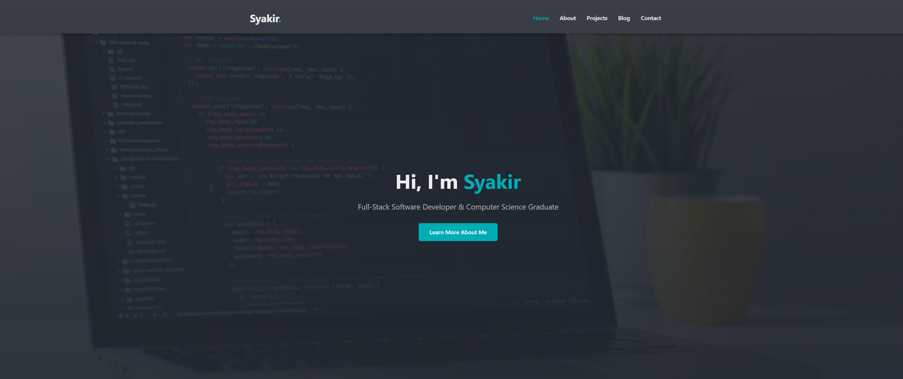
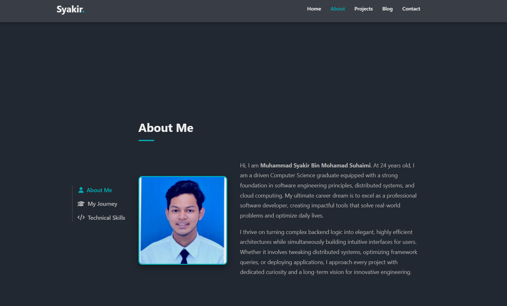
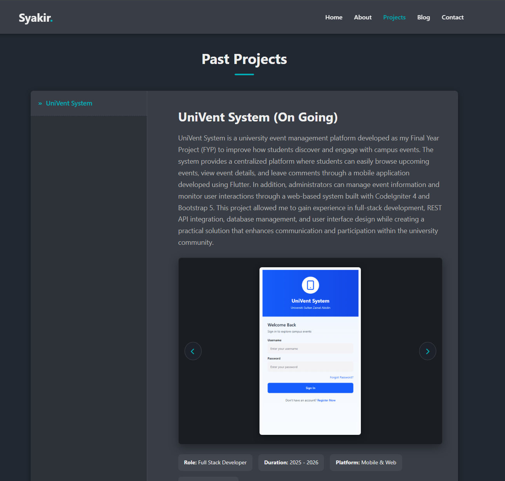
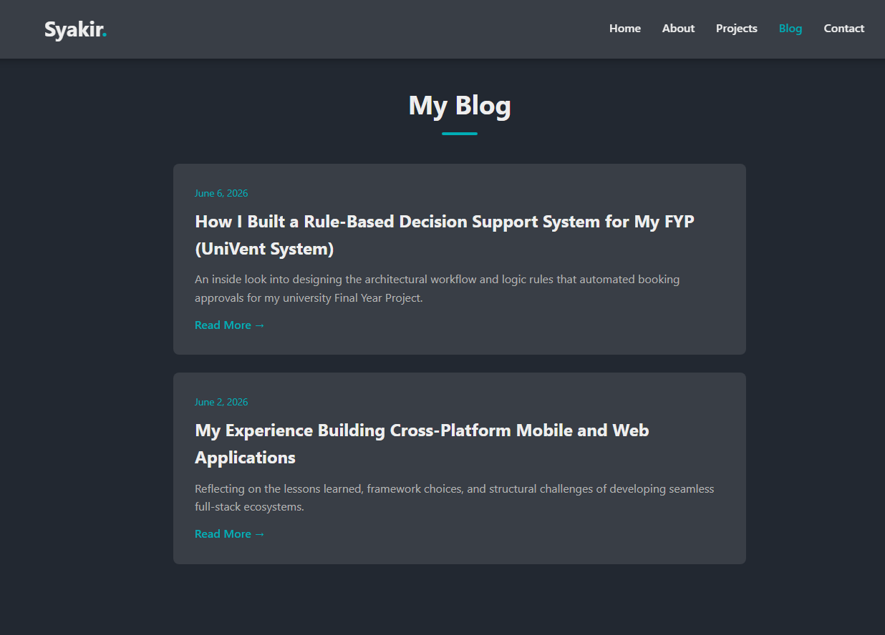
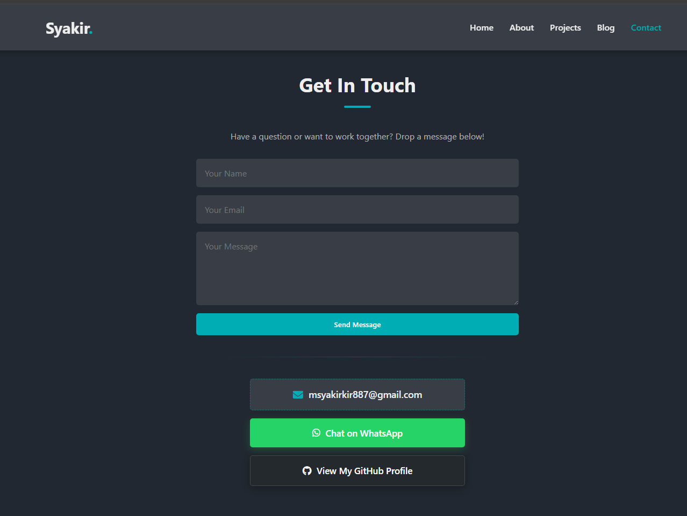

# Personal Portfolio Website

## Overview

This project is a personal portfolio website developed as part of the CSD34203 Special Topics in Software Development course. The website serves as an online portfolio to showcase personal information, technical skills, projects, and blog articles.

The portfolio is designed using HTML, CSS, and JavaScript with a responsive layout to ensure accessibility across different devices.

---

## Features

### Home Page

* Introduction and personal profile
* Navigation to all website sections

### About Page

* Personal background
* Educational information
* Skills and interests

### Projects Page

* Showcase of completed software and technical projects
* Project descriptions and technologies used

### Blog Page

* Collection of blog articles
* Easy navigation between posts

### Blog Posts

* Blog Post 1
* Blog Post 2

### Contact Page

* Contact information
* Easy way for visitors to reach out

### Additional Features

* Responsive design for mobile and desktop devices
* Custom styling using CSS
* Interactive elements using JavaScript

---

## Technologies Used

* HTML5
* CSS3
* JavaScript
* Git
* GitHub

---

## Project Structure

```text
portfolio/
│
├── css/
│   └── style.css
│
├── js/
│   └── javascript.js
│
├── img_pro/
│   └── img1.jpg
│   └── img2.jpg
│   └── img3.jpg
│   └── img4.jpg
│   └── img5.jpg
│   └── img6.jpg
│   └── img7.jpg
│   └── img8.jpg
│   └── img9.jpg
│   └── img10.jpg
│
├── index.html
├── about.html
├── project.html
├── blog.html
├── blog-post-1.html
├── blog-post-2.html
├── contact.html
├── README.md
│
└── img1.jpg
```

---

## How to Run the Project

1. Download or clone the repository.

```bash
git clone https://github.com/syakir2002/personal-blog.git
```

2. Open the project folder.

3. Open `index.html` in any modern web browser.

No additional software installation is required.

---

## Screenshots

### Home Page



### About Page



### Projects Page



### Blog Page



### Contact Page



---

## Future Improvements

* Dark mode support
* More blog articles
* Project filtering system
* Contact form with backend integration
* Portfolio analytics

---

## Author

**Muhammad Syakir Mohamad Suhaimi**

Student of Faculty of Informatics and Computing (FIK)

Course: CSD34203 Special Topics in Software Development

---

## GitHub Repository

Repository Link:
[https://yourusername.github.io/portfolio/](https://github.com/syakir2002)

Demo Link (GitHub Pages):
[https://github.dev/syakir2002/personal-blog/settings/pages](https://syakir2002.github.io/personal-blog/)
